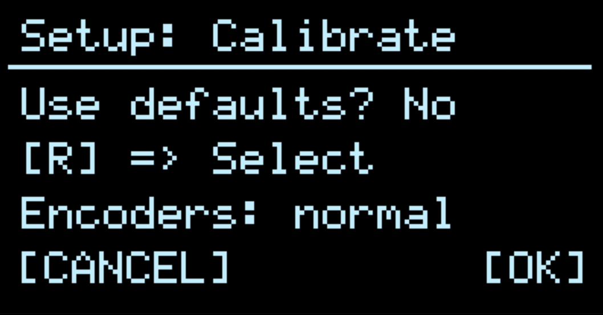
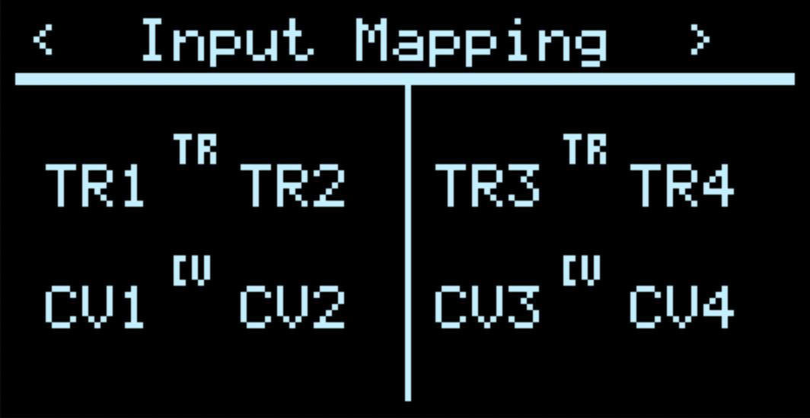
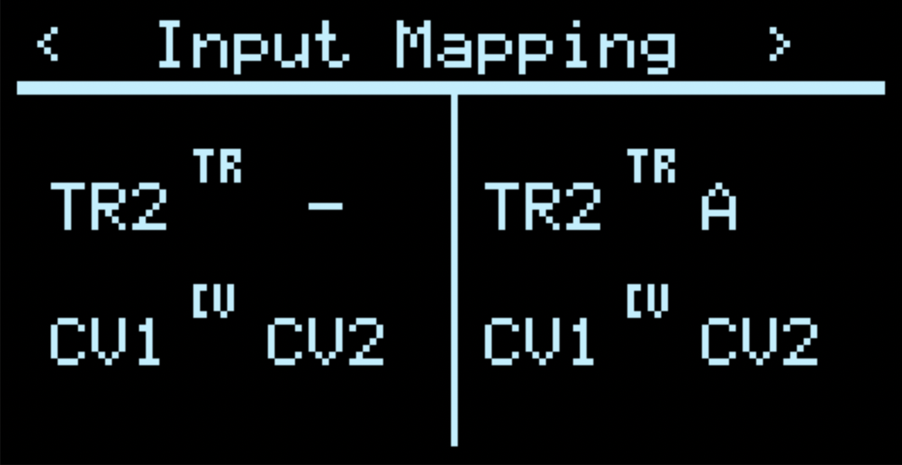
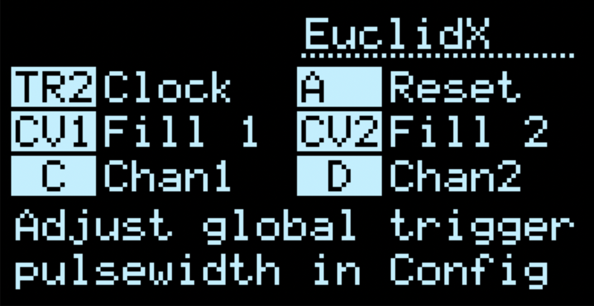
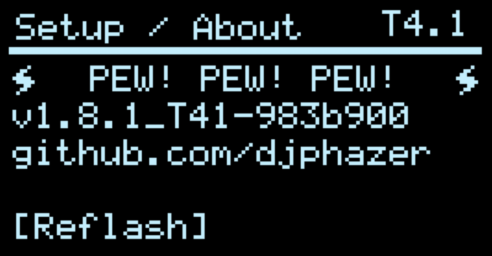

# Frequently Asked Questions
{: .no_toc :}

- TOC
{:toc}

## Q: How do I switch Apps?

A: In v2.0+, hold 'Z' or 'A' (aka the UP button on O_C) and press the Right Encoder to find the main App Menu. See the [UI Gestures](Hemisphere-Gestures) page for more info.
_(in v1.x firmwares, Long-press the Right Encoder for main menu.)_

## Q: Where are all the Applets?

A: The _Applets_ can be found within the **Hemispheres** App on O_C or [**Quadrants**](Quadrants) App on ORN8. All the same CV applets are available on both, for T4.0 or T4.1. Most updates can be backported to T3.2, excluding any extra settings storage.

## Q: How do I set the default app on startup?

A: Long-press the Right Encoder while on the main App Menu to save _Global Settings_, including the currently selected App. This does not necessarily save your [Preset](https://firmware.phazerville.com/Hemisphere-Presets) within the App, unless you've turned on [Auto-Save](https://firmware.phazerville.com/Hemisphere-Presets#auto-save).

## Q: Why are some Apps or Applets missing from the firmware? <a id='missing-apps'>

A: Technical limitations will always be there to stop you from having all the cake. If any given program or feature is documented here, that means it exists in the source code, even if it isn't included in every compiled binary release. It's easier than ever to build your own custom firmware to exclude things you don't need and make room for other things from the ever-growing library of Phazerville - that's part of the fun! Open Source, baby!!

Check [the wiki](https://github.com/djphazer/O_C-Phazerville/wiki) for tips on development to get started.

## Q: What is AuxButton?

A: In Hemispheres/Quadrants, after pressing the encoder button to _highlight an applet parameter for editing_, the corresponding select button (UP or DOWN on O_C, or A/B/X/Y on ORN8) invokes a _secondary action_ in some places, often indicated by a dotted line cursor instead of a solid line. This contextual override provides additional UI actions with a very limited set of controls. See also: [**UI Gestures**](Hemisphere-Gestures)

## Q: How do I calibrate the hardware? <a id='calibration'>

A: See the app [Setup/About](Setup-About)

## Q: How do I run it upside-down?

A: There's a quick gesture to toggle FLIP mode (A+B or UP+DOWN) right inside the [**Setup / About**](Setup-About) App. After saving, a power cycle is required.

## Q: My encoders are going the wrong way! How do I change them? <a id='encoders'>

A: If your encoders don't rotate the way you expect, you can flip the behaviour of one, the other, or both as part of the [Setup / About](Setup-About) calibration routine.

After selecting "Calibrate" in Setup / About (short press of LEFT encoder), press either the UP and DOWN buttons to choose your encoder reversal: L, R, both (LR), or neither (normal) — press the RIGHT encoder to accept.

If you want to use non-default calibration, you will need to scroll through the entire calibration routine to save the encoder reversal setting (rotate LEFT encoder to the last page, press RIGHT encoder to save).

## Q: How do the physical Input and Output jacks connect to the Apps / Applets? <a id='io'>

A: Each Applet has 2 trigger inputs, 2 CV inputs, and 2 outputs - this is **logical** or **virtual** I/O. Any of the **physical** input jacks (trigger/gate and CV) may be flexibly [mapped](Hemisphere-Input-Mapping) to any of the 4 virtual (software) inputs of each Applet. The virtual outputs of each Applet slot are hardcoded to the physical outputs sequentially: A/B (Left side), C/D (Right side), etc. All the virtual outputs may also be routed to the virtual inputs (loopback).

Using the [Input mapping screen](Hemisphere-Input-Mapping), you can configure applets to share physical Triggers or CV sources, directly route the output of one applet as the input of another, or disable (mute) a physical input jack.

**NOTE: Some full screen apps (those other than the original stock apps) will respect the current input mapping saved within Hemisphere. Within full screen apps, the name displayed for a given input corresponds to its _software_ destination (i.e. its position within the Input Mapping Config)**

The input mapping above reflects the traditional default behaviour of O_C: Left and Right Hemispheres with independent digital and CV inputs, corresponding to their physical jack locations on most 8hp hardware.

In the example above, the input mapping reflects an alternative behaviour: both Left and Right Hemispheres map TR2 to their 1st virtual digital input (which in many cases will be used for clock). The 2nd virtual digital input is disabled for the Left Hemisphere, and for the Right Hemisphere it is the 1st output of the Left Hemisphere (Output A). In this case, both Hemispheres share control voltage inputs CV1 and CV2.

You may map physical Digital inputs to virtual CV inputs and vice versa.

Within Hemisphere, each applet's help screen will dynamically label the physical input and output jacks currently mapped to each parameter. Trigger inputs may also be remapped via the [Clock Setup screen](Clock-Setup)

## Q: How does external clock sync work? <a id='clock'>

A: See the [Clock Setup screen](Clock-Setup)

An external clock may be used to set tempo in Hemisphere, either from:
- Triggers sent to TR1 (hardcoded to the physical input)
- MIDI input clock

When the clock is armed, the next trigger at TR1 will start the clock. MIDI run/stop messages will be respected.

While playing, Hemisphere will automatically detect the incoming tempo, and stop automatically when pulses cease.

The `Sync` parameter is PPQN (pulses per quarter note), or how many ticks of an external clock tick correspond to an internal clock tick.

After BPM detection, triggers are passed to applets according to their corresponding clock multiplication or division, with `Swing` (if enabled – % parameter is editable under `BPM`)

To disable external clock sync, set `Sync` to 0

**NOTE: when clock pulses are recieved at both TR1 and MIDI, the result is simply mixed, potentially resulting in an unstable BPM detection**

## Q: How do I trigger applets from the internal clock? <a id='int-clock'>

A: See the [Clock Setup screen](Clock-Setup)

You can forward internal clock pulses (or multiples / divisions thereof) to any trigger destination. Dual press UP+DOWN buttons to access the clock menu, and adjust the div/mult for each trigger destination. By default, each destination is blank (x0) and will ignore the internal clock.

## Q: What is the deal with the quantizer engines? <a id='quantizers'>

A: Instead of single, individual quantizers built into each applet, applets now share access to a pool of 8 quantizer engines (Q1 - Q8) which can be configured in either a pop-up window, or in the [configuration menu](Hemisphere-Quantizer-Setup). Each Q-engine includes a root note, scale, octave adjustment, and note mask.

Some simple quantizer applets, like **DualQuant** or **Squanch**, are hardcoded to use the Q-engine for the corresponding DAC channel - Q1 for output A, Q2 for B, etc. Many other applets have a parameter to select a Q-engine from the pool, and some allow CV modulation of the selected Q-engine. While editing the Q parameter, a dark pop-up window briefly displays the settings for that engine.

To edit the active Q-engine in an applet, select the Q parameter and press the Aux Button: UP or DOWN depending on context. This will open an inverted (white) pop-up editor, with context hints. Use the LEFT encoder to move the edit cursor, and adjust settings with the RIGHT encoder. The first parameter of the note mask is rotation. UP/DOWN (or A/B) for octave jump. Press either encoder to exit.

Or, see the [configuration menu](Hemisphere-Quantizer-Setup) to edit all 8 engines.

## Q: Do I have to take the module out of my rack every time I want to update the firmware? <a id='ezflash'>

A: Not if you are updating from Phazerville v1.8.1 or later! If so, you can reflash without accessing the button at the back of the module (so long as you have a USB connection)

To do so:

1. Navigate to the Setup / About App
2. Turn the LEFT encoder — the display should read “Reflash”

3. Press the LEFT encoder to enter Flash Upgrade Mode, and proceed with the remaining instructions
4. Open the [Teensy Loader](https://www.pjrc.com/teensy/loader.html) application on your computer
5. Drag and drop the desired .hex file onto the Teensy Loader application
6. Within the Teensy Loader click the Program icon, or choose Program from the Operation menu
5. You should briefly see a progress bar as the firmware is uploaded
6. Within the Teensy Loader, click the reboot icon or choose Operation > Reboot
7. The module should restart with your new firmware, without ever having to touch a screwdriver
