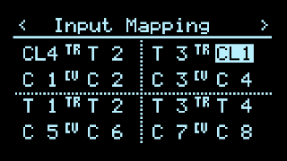
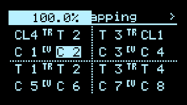

# Input Mapping

This full-screen page in the [config menu](Hemisphere-Config) is for remapping software input sources to any of the physical input jacks, outputs A-D (self-patching), MIDI Maps, etc.

Every applet has 2 trigger inputs and 2 CV inputs. Here, you can remap which physical inputs are routed to the applet's logical inputs. The trigger map settings also appear in [Clock Setup](Clock-Setup).

Trigger inputs all have an accompanying multiplier/divider setting, and CV inputs all have an attenuverter amount setting, which appear for editing in the header after a 2nd click on each mapping.

### Side Effects
Input Mapping settings may also affect other full-screen apps based on the Hemisphere Suite backend, such as Calibr8or, Darkest Timeline, Enigma, etc. (but not the original stock Apps).
