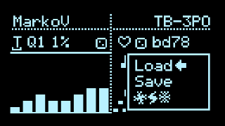
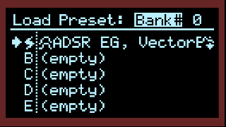
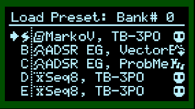
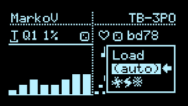

# Presets

## Floating Config Menu: Presets

The first few options in the [config menu](Hemisphere-Config) are **Load**, **Save**, **(auto)**, and a **randomize** action.

Rotate either encoder to select, push to enter. Press one of the select buttons to cancel. Applets with their state are recalled, along with Clock settings, General Settings and Input Mappings.

The **randomize** action (indicated with strange symbols) resets Input Mappings and Clock settings to defaults, and picks applets at random for inspiration.

The preset picker in Quadrants, using internal LittleFS storage (above) or microSD card (below)

saved Presets show the names of the applets in each slot, and the currently loaded slot is indicated with a Zap icon. In Quadrants, the current Bank is shown in the upper right corner, with inverted text when no SD card is detected/mounted. (Using an SD card is highly recommended!)

In this menu screen:
* rotate LEFT Encoder to toggle between Load, Save, and DELETE.
* (Quadrants only) Push LEFT Encoder to switch Banks.
* Rotate/Push RIGHT Encoder to make a selection (rotate and push).

Note that [release builds](https://github.com/djphazer/O_C-Phazerville/releases) have a varying number of preset slots depending on the hardware platform. For T32, the default is 8, but you can opt for 4, 8, or 16 with a [Custom Build](https://github.com/djphazer/O_C-Phazerville/discussions/38). T40 has 50 slots. T41 uses 32 slots per Bank, with virtually unlimited Bank files stored in flash or a microSD card.

***

### Load Presets via MIDI PC

Sending MIDI Program Change messages will load the corresponding preset:
* Value 0: Preset A
* Value 1: Preset B
* Value 2: Preset C
* Value 3: Preset D

...etcetera, up to however many presets are enabled in your build: 4, 8, or 16; 50 in T40; 32 per Bank in Quadrants.

The MIDI Channel used to receive PC messages can be configured on the next page, [General Settings](Hemisphere-General-Settings).

***

### Auto-save

If enabled, settings are automatically stored in the last loaded Preset when the screensaver is invoked, or when visiting the Main Menu via Right Encoder Long-press. (You can set the screensaver timeout as low as 1 minute in Calibration)

When storing a Preset, settings are immediately written to EEPROM (or LFS storage on T4.0) - no need to manually do an [EEPROM Save](Saving-State), unless you need to save changes to global patterns, etc. Combined with Auto-save, this can result in frequent EEPROM writes... (only 100,000 write cycles are guaranteed, so use at your own risk!)
