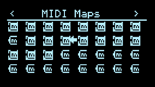
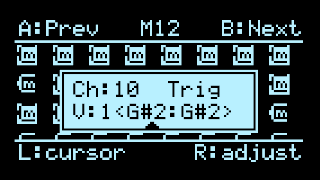

# MIDI Maps

_New in v1.10!_ This full-screen page in the [config menu](Hemisphere-Config) shows you all the mappings for global [MIDI Input](MIDI-Input) sources in one place and allows you to edit them.

Each of the 32 icons shows whether that MIDI Map is already configured (inverted icon) and, if so, a thin vertical meter indicating signal level. Selecting one with the RIGHT Encoder displays a popup editor, very similar to the Q-engine popup editor:

* LEFT Encoder moves the cursor
* RIGHT Encoder edits the value at the cursor
* A and B jump to the previous/next MIDI Map slot
* (TODO: Z for auto-learn...)
* Push either encoder or any other button to exit

Check the [MIDI Input](MIDI-Input) applet docs for more info about the options available in the popup editor, used to filter incoming MIDI traffic.
