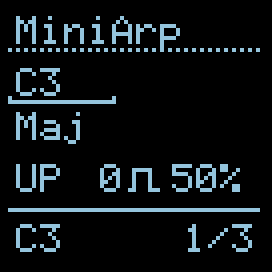
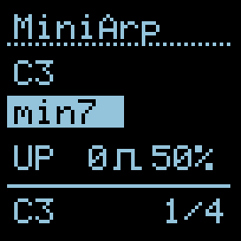
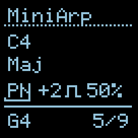
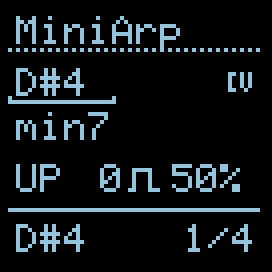
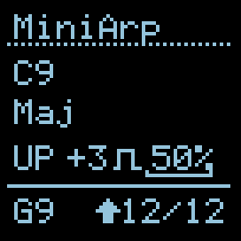
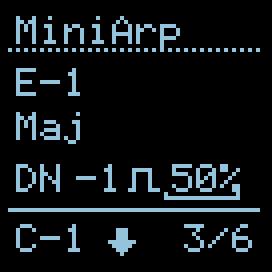

# MiniArp

*Version 1.1.1*

**MiniArp** is a compact gate-driven arpeggiator inspired by the [2hp Arp](https://www.twohp.com/modules/arp). It plays the notes of one of 19 tone sets (14 chords, 3 pentatonic scales, 2 intervals) in a chosen playback mode across up to 4 octaves. Every incoming clock pulse advances the arpeggio one step. The root note and the tone set can both be modulated from CV.

### I/O

|        |                 1/3                  |                  2/4                  |
| ------ | :----------------------------------: | :-----------------------------------: |
| TRIG   | Clock — advance to the next step     | Reset to the first step               |
| CV INs | Root offset (1V/oct, quantised)      | Chord selector offset (0..+5V sweeps) |
| OUTs   | Pitch (V/oct)                        | Gate pulse (length = Gate %)          |

### UI Parameters

* **Root** — the root MIDI note of the arpeggio (C-1 .. G9). Quantised CV at input 1 is added in semitones.
* **Chord** — one of 19 tone sets (see table below). CV at input 2 sweeps proportionally across the list.
* **Mode** — playback mode (7 options — UP / DN / PN / PP / PD / BR / RN).
* **Oct** — octave range shift, Keystep-style: `-1`, `0`, `+1`, `+2`, `+3`. See below.
* **Gt.len** — gate pulse length, 1..99 % of the current clock period (minimum 10 ms floor).

Cursor order on the screen: **Root → Chord → Mode → Oct → Gt.len**.

The cursor uses the standard Hemisphere two-state visual: a **blinking underline** beneath the value in NAV (just selecting), an **inverted box** around the value in EDIT (encoder changes it). While editing Root or Chord, the value momentarily shows the *base* knob value (not the CV-modulated effective value) so the encoder feedback is unambiguous.

### Tone Sets (19)

First 14 follow the 2hp Arp manual order. Then 3 pentatonic scales. Then 2 intervals.

| Label  | Intervals (semitones)   | Common name              |
| ------ | ----------------------- | ------------------------ |
| Maj    | 0, 4, 7                 | Major                    |
| Maj7   | 0, 4, 7, 11             | Major 7                  |
| Dom7   | 0, 4, 7, 10             | Dominant 7               |
| min    | 0, 3, 7                 | Minor                    |
| min7   | 0, 3, 7, 10             | Minor 7                  |
| dim    | 0, 3, 6                 | Diminished               |
| hdim7  | 0, 3, 6, 10             | Half-diminished 7 (m7♭5) |
| dim7   | 0, 3, 6, 9              | Fully diminished 7       |
| aug    | 0, 4, 8                 | Augmented                |
| aug7   | 0, 4, 8, 10             | Augmented 7              |
| sus2   | 0, 2, 7                 | Sus 2                    |
| sus4   | 0, 5, 7                 | Sus 4                    |
| s4M7   | 0, 5, 7, 11             | Sus 4 / Major 7          |
| s4m7   | 0, 5, 7, 10             | Sus 4 / Minor 7 (7sus4)  |
| majP   | 0, 2, 4, 7, 9           | Major pentatonic         |
| minP   | 0, 3, 5, 7, 10          | Minor pentatonic         |
| bluM   | 0, 3, 5, 6, 10          | Minor blues (+♭5)        |
| 5th    | 0, 7                    | Power chord              |
| Oct    | 0, 12                   | Octave doubler           |

**Note on Oct and octave range.** `Oct = {0, 12}` combined with a non-zero octave shift produces intentional duplicate notes: `C, C', C', C'', C'', C'''` for `+3`. This is by design — useful as a rhythmic pulse with octave steps. If you want *non-duplicating* octave climb, use `5th`, `Maj`, or any other set with more than one distinct tone.

### Playback Modes (7)

| Label | Description                                                             |
| ----- | ----------------------------------------------------------------------- |
| UP    | Ascending — `0, 1, 2, …, M-1` repeat                                    |
| DN    | Descending — `M-1, M-2, …, 0` repeat                                    |
| PN    | **Pendulum** — endpoints play **once**: `0,1,2,…,M-1,M-2,…,1`           |
| PP    | **Ping Pong** — endpoints play **twice**: `0,1,…,M-1,M-1,M-2,…,0`       |
| PD    | **Pedal Point** — root against ascending others: `0,1,0,2,0,3,…,0,M-1` |
| BR    | **Brownian** — drunken walk: 50% forward, 25% stay, 25% back            |
| RN    | **Random** — uniform over `[0, M)` on every step                        |

Terminology follows Intellijel Metropolix v1.4. `M` = `tones_in_set × octave_range`.

- **PD (Pedal Point)** gives the classic organ-pedal sound — a fixed root note alternating with every other note in the set. On `Maj` × 3 octaves this becomes a dramatic C against ascending E G C' E' G' C'' etc.
- **BR (Brownian)** is a gentler alternative to pure Random — probabilities 50/25/25 produce a walk that drifts forward with occasional repeats and reversals. Feels organic, not noisy.

Mid-playback display — `PN` mode, `+2` octaves expand the 3-note `Maj` set to `M=9` slots, the bottom row's `step / total` field shows the current position (`5/9` here):

### Octave Range (Oct)

Keystep-style: `-1, 0, +1, +2, +3`.

| Value | Effect                                              | Resulting range        |
| ----- | --------------------------------------------------- | ---------------------- |
| `-1`  | Expand **down** one octave                          | octaves -1, 0          |
| ` 0`  | Play only the source octave                         | octave 0               |
| `+1`  | Expand **up** one octave                            | octaves 0, +1          |
| `+2`  | Expand up two octaves                               | octaves 0, +1, +2      |
| `+3`  | Expand up three octaves                             | octaves 0, +1, +2, +3  |

Asymmetry is intentional: higher registers are more useful in arpeggiators, while `-1` covers the "doubled bass" case.

### Modulation

- The **CV icon** appears next to Root or Chord while the corresponding CV input is actively shifting the value.
- Root CV uses 1V/oct semitones (e.g. +1V = +12 semitones). The knob value sets the base MIDI note; CV is added on top.
- Chord CV is proportional: +5V adds +19, −5V subtracts 19. The result is clamped to the valid range. A small dead-zone (≈ 62 mV around 0V) prevents idle noise from drifting the selection.

### Gate

- The bottom row of the screen shows the current playing note (e.g. `C3`) and `step / total` position.
- A small gate icon next to the Gate % value lights up while the physical gate output is high — useful for visual timing feedback.
- If the requested gate duration is shorter than 10 ms (very fast clock + short %), the pulse is stretched to 10 ms minimum so downstream envelopes and drum modules reliably trigger.

### Clip Indicator

An arrow next to the playing note lights up when the computed MIDI note exits the 0..127 range and has to be clamped:

- `↑` — clipped **up** (beyond G9). Typical cause: high Root + `+3` octave range.
- `↓` — clipped **down** (below C-1). Typical cause: low Root + `-1` octave, or a large negative Root CV.

| Up clip                                        | Down clip                                        |
| ---------------------------------------------- | ------------------------------------------------ |
|  |  |

Lower (or raise) the Root, or choose a smaller octave range.

### Persistence

State is packed into 64 bits: `root` (7), `chord` (5), `mode` (3), `oct_shift` (3, stored as unsigned offset), `gate_pct` (7). Presets from v1.0.0 are **not compatible** — re-save after update.

### Credits

Inspired by the [2hp Arp](https://www.twohp.com/modules/arp), extended with ideas from Intellijel Metropolix (Pedal Point, Brownian, Pendulum / Ping Pong terminology) and Arturia KeyStep Pro (octave range parameter). Adapted to Hemisphere by Victor Kuznetsov for O\_C-Phazerville.
