# ShiftArp

*Version 1.3.0*

**ShiftArp** is a shift-register arpeggiator inspired by the Flatsix [Arp of Darkness](https://flatsixmodular.com/). Instead of arpeggiating a predefined chord, ShiftArp builds its own sequence from notes you feed in live through the CV/gate inputs **or hand-edited in a modal buffer editor**. Those notes sit in a FIFO buffer of adjustable length (3..16 notes), and the applet plays them back in one of ten modes — from simple forward/back through Golden Ratio to Shuffle, Pedal Point, and a shifting window. A built-in **per-applet quantizer** (independent from the global Hemisphere scale engine) shapes the output through scale, root, octave shift, and a per-degree mask — all stored per-preset together with the buffer.

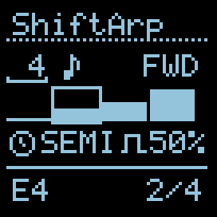

### I/O

|        |                 1/3                     |                 2/4                     |
| ------ | :-------------------------------------: | :-------------------------------------: |
| TRIG   | Clock — advance the playhead by one step | Reset the playhead to the first position |
| CV INs | Pitch source (quantised to semitones on capture) | Capture gate — rising edge pushes CV1 into the buffer |
| OUTs   | Pitch (V/oct, after scale quantiser)     | Gate pulse (length = Gate %)            |

### UI Parameters

* **Length** — how many notes of the buffer take part in playback, 3..16. Buffer physically holds 16 slots; this value is the active window. Right-aligned in the top-left field.
* **Edit** (note icon) — opens a modal buffer editor (see *Buffer editor* below).
* **Mode** — playback pattern (10 options, see below). Shown as 3-char uppercase label in the top row, right-aligned to the side edge.
* **Apply** — `Imm` (zap) applies Length/Mode changes immediately, `Qd` (clock) queues them until the start of the next cycle.
* **Scale** — 4-character label of the active local scale. A click opens ShiftArp's own modal scale editor (see *Scale editor* below). Default is `SEMI` (chromatic, pass-through). The local scale/root/octave/mask state is per-preset and independent from any other applet on the same side.
* **Gt.len** — gate pulse length, 1..99 % of the clock period (10 ms minimum floor).

Cursor order: **Length → Edit → Mode → Apply → Scale → Gt.len**.

| Cursor on Mode                                                 | Cursor on Scale                                                  |
| -------------------------------------------------------------- | ---------------------------------------------------------------- |
| 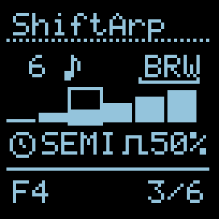 | 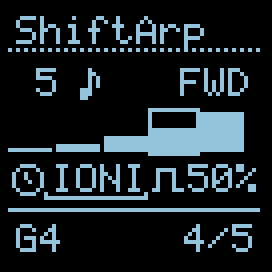 |

When the buffer hasn't captured anything yet, the bar-graph row reads `- empty -` and the status row shows `empty` in place of a step counter:

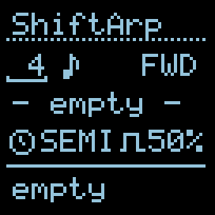

### Playback Modes

Ordered by "increasing freedom": Direction → Patterned → Generative.

**Direction** — linear traversals, fully deterministic and predictable:

| Label | Description                                                                              |
| ----- | ---------------------------------------------------------------------------------------- |
| FWD   | Forward — oldest captured note first, advance to the newest, then loop                   |
| BCK   | Backward — newest first, descend to the oldest, then loop                                |
| PND   | **Pendulum** — forward then backward, **endpoints play once** (per Metropolix)           |
| PPG   | **Ping Pong** — forward then backward, **endpoints repeat** (per Metropolix)             |

**Patterned** — non-linear motion, but still deterministic:

| Label | Description                                                                              |
| ----- | ---------------------------------------------------------------------------------------- |
| PDL   | **Pedal Point** — the oldest note as pedal against ascending others: `0,1,0,2,0,3,…`    |
| WIN   | **Shift Window** (size 3) — `012, 123, 234, …` sliding 3-note window (Metropolix Arp 3)  |
| PHI   | **Golden ratio** — Weyl sequence, evenly distributed but non-linear                      |

**Generative** — increasing entropy in the moment:

| Label | Description                                                                              |
| ----- | ---------------------------------------------------------------------------------------- |
| SHF   | **Shuffle** — one random permutation of the buffer, replayed cyclically until RESET     |
| BRW   | **Brownian** drunken walk — 50% forward / 25% stay / 25% back (per Metropolix)          |
| RND   | Random — any buffer slot on every step                                                   |

**Buffer order.** When you capture, the oldest note sits at position 1, newest at position N (FIFO). Forward plays them in entry order (what you played is what you hear). Backward inverts.

**Golden ratio (PHI).** Next index ≈ `(step × ⌈N·0.618⌉) mod N`. The jump is co-prime to N for most sizes, so every slot is visited, but the order feels organic — neither linear nor random. Signature mode of the original Arp of Darkness.

**Pedal Point (PDL).** The oldest captured note becomes a "pedal" — it plays on every odd step. Even steps walk through the remaining notes in order: `0, 1, 0, 2, 0, 3, …, 0, N-1`. Classic organ-pedal sound, works especially well with long buffers.

**Brownian (BRW).** A drunken walk with 50 / 25 / 25 probability (forward / stay / back). Gentler and more musical than pure RND — the sequence drifts forward but occasionally revisits or backtracks. State is reset on every RESET trigger.

**Shuffle (SHF).** On the first playback pass after RESET (or a change in N), the applet generates a random permutation of `0..N-1` and plays through it. Subsequent passes repeat the *same* order — like shuffling a deck of cards and dealing them out again. Send RESET to reshuffle. Different from RND: RND is a dice roll on every step, SHF is one shuffle replayed.

**Shift Window (WIN).** A 3-note window slides across the buffer: `012, 123, 234, …`, one index per step. Each window plays out fully before the window advances by one slot. With a buffer of 8 notes you get: `0,1,2, 1,2,3, 2,3,4, 3,4,5, 4,5,6, 5,6,7, 6,7,0(wrap), 7,0,1, …`. Signature-feel for shift-register arpeggiators.

### Capturing notes

When CV2 crosses ~2.0 V (rising edge with Schmitt hysteresis to reject noise), the applet waits ~5 ms for CV1 to settle, then reads and quantises it to the nearest semitone, pushing the result into the buffer head. The buffer is a classic FIFO — once full, the oldest note is dropped to make room.

Typical patch: V/Gate from a keyboard, sequencer, or quantiser feeds CV1 and CV2. Every new note played gets recorded; the arp is always the last N notes you touched.

### Buffer visualisation

Row 2 of the screen shows a tiny bar graph of the active buffer window. Heights are normalised to the min/max of the current content (so small pitch differences are visible). The bar under the playhead is framed.

### Local quantizer (per-applet, per-preset)

ShiftArp keeps its **own** quantizer instance per side, separate from the global Hemisphere `q_engine[]`. Scale, root, octave shift, and the per-degree mask all live in the preset payload — saved and restored together with the buffer. Changing the scale here doesn't affect any other applet on the same side.

The buffer stores raw **chromatic** MIDI notes (0..127). On every clock the current slot is passed through the local quantizer (`scale + root + mask`) and then octave-shifted before reaching OUT A.

### Scale editor

Navigate the cursor to the **Scale** field and press the encoder. A modal scale editor takes over the applet side. Cursor positions in order:

```
Scale → Mask bit 1 → Mask bit 2 → … → Mask bit N → Root → Oct
```

(N = number of degrees in the active scale, e.g. 12 for SEMI, 7 for IONIA.)

| Cursor on Scale                                                 | Cursor on a Mask bit                                              |
| --------------------------------------------------------------- | ----------------------------------------------------------------- |
| 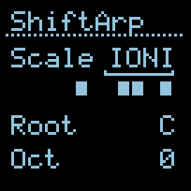 | 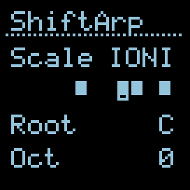 |
| Cursor on Root                                                  | Cursor on Oct                                                     |
| 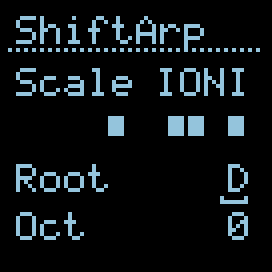 | 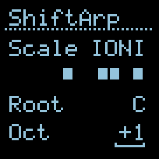 |

| Field      | NAV behaviour                       | EDIT / click behaviour                                         |
| ---------- | ----------------------------------- | -------------------------------------------------------------- |
| **Scale**  | Cursor blink-underline beneath name | Click → enter EDIT, encoder picks scale (no wrap, 0..NUM-1)     |
| **Mask**   | Cursor highlights one cell          | **Click directly toggles** the cell (no NAV→EDIT step). Last enabled bit can't be turned off (would silence playback). |
| **Root**   | Underline beneath root name         | Click → EDIT, encoder rolls C..B (cyclic)                       |
| **Oct**    | Underline beneath signed value      | Click → EDIT, encoder shifts -3..+3 octaves                     |

Mask cells: filled square = degree enabled, empty = disabled.

When the scale changes, the mask cell count adapts (number of degrees), and the cursor clamps to the last valid position so it never falls off the end.

**Exit the editor**: press the **side button** on this hemisphere (the same one that normally toggles select-mode). It routes through `AuxButton()` and closes the modal cleanly — no timing involved.

### Buffer editor

Navigate the cursor to the **Edit** (note icon) field and press the encoder to open a modal buffer editor that takes over the applet side. Two sub-modes:

* **NAV** (↔ icon in the header) — encoder moves the cursor between slots (wraps).
* **PITCH** (pencil icon in the header) — encoder changes the pitch of the current slot in chromatic semitones. Turning down past `C-1` (MIDI 0) makes the slot a **rest**.

| NAV — ↔ icon                                       | PITCH — pencil icon                                  |
| -------------------------------------------------- | ---------------------------------------------------- |
| 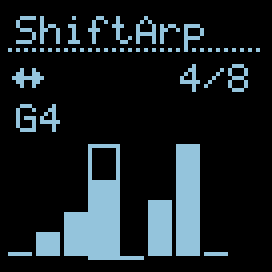 | 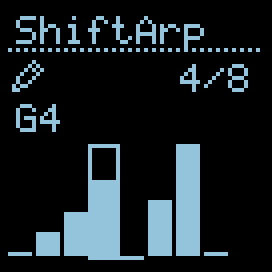 |

**Single click** toggles NAV ↔ PITCH. **Side button** exits the editor cleanly (AuxButton route). **Double click** anywhere wipes the buffer and closes the editor.

The editor draws all `Length` slots as bars. Bar heights are normalised to the min/max of active (non-rest) notes — same trick as the main view's buffer visualisation, so small intervals stay visible.

| Mark                     | Meaning                                                              |
| ------------------------ | -------------------------------------------------------------------- |
| Tall bar (any height)    | Active note — relative pitch within the buffer's range               |
| Thin line at the bottom  | Rest — slot exists but plays no gate                                 |
| Single dot in the middle | **Inactive slot** — nothing recorded yet (`i ≥ buf_count`)           |
| Frame around a slot      | Cursor — currently selected slot                                     |

Header shows the mode icon (left) and slot index `i/L` (right-aligned). The line below the header shows the current slot's note name (`C4`, `D#5`…), `- rest -`, or `- empty -` for inactive slots.

| Cursor on a rest slot                                | Cursor past `buf_count` (inactive slot)                              |
| ---------------------------------------------------- | -------------------------------------------------------------------- |
| 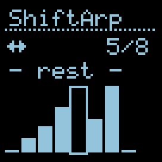 | 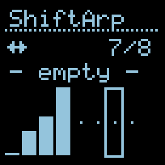 |

**Lazy expansion.** Opening the editor does **not** change playback — `buf_count` stays as it was. If you start editing a slot beyond the current `buf_count` (i.e. beyond what was captured), the buffer expands: gaps fill with `rest`, and `buf_count` jumps to include the slot you just touched. This makes the editor work both for "tweak captured notes" and "compose from scratch" without the playback length suddenly stretching.

**Capture vs manual editing.** The CV2 capture continues to work while the editor is open and afterwards. If you want to compose without interference, disconnect or stop the CV2 source — otherwise incoming captures will overwrite your manual edits.

### Reset & clear

* **DIG2 (Reset)** — returns the playhead to position 1 on the next clock. Always immediate — the Apply switch does not affect it (you control the timing yourself by when you send the trigger). Also rewinds the Brownian walker and re-shuffles SHF with a fresh random permutation.
* **Double-click the encoder** (within 480 ms) — clears the buffer. Status row shows `empty` until the first capture.
* **Reset via Hemisphere global `auto_reset`** (e.g. starting the internal BPM clock) — also pulls the playhead back to 1.

### Apply mode

Changes to **Length** and **Mode** can be either immediate or queued:

* **Zap icon** `Imm` — the change takes effect on the next clock.
* **Clock icon** `Qd` — the change is held until the playhead wraps past the last step of the current cycle; a small dot appears next to the pending parameter to indicate something is queued.

Handy for live play: set Qd, dial in a new mode mid-cycle, hear it slot in cleanly at the bar line.


### Persistence

When a Hemisphere preset is saved, ShiftArp now stores **everything that defines the sound**: length, mode, gate %, apply mode, **buf_count**, **the entire 16-slot note buffer** (including rest slots), and the local quantizer state (**scale, root, octave shift, mask**). Brownian walker position and Shuffle permutation are intentionally *not* persisted — they reseed on every load to keep generative modes fresh.

The buffer (16 × 8 bits = 128 bits) lives in two extra payload slots provided by the new Hemisphere extra-slots API (`ExtraSlots() = 2`). All other state fits in the standard 64-bit base payload.

> **Old presets.** Presets saved by v1.0.x..v1.2.x don't carry the buffer or the local quantizer state. On load they're treated as defaults (SEMI scale, C root, 0 octave, all-on mask, empty buffer). Re-save the preset after upgrade to capture the current state going forward.
>
> **Length-bit fix history.** v1.0.0 stored `Length=16` in only 4 bits and silently truncated to 3 on reload. Fixed in v1.2.0 by widening to 5 bits — pre-fix presets re-load with shifted values, also fixed by re-saving.

### Status row

The bottom of the screen shows:

* Current playing note (MIDI note name, **after** scale quantisation — matches what is coming out of OUT A).
* Step counter `idx / N` right-aligned.
* When the buffer is empty: the word `empty`.

### Credits

Inspired by Flatsix's [Arp of Darkness](https://flatsixmodular.com/). Shift-register concept, 6 original playback modes (including Golden Ratio), and buffer lengths 3..16 are taken directly from the original. PDL / BRW / SHF / WIN modes come from Intellijel Metropolix v1.4 (Pedal Point, Brownian, Shuffle, Arp N Shift). Gate-capture via CV, the modal buffer editor, the per-applet local quantizer with per-preset persistence, and the immediate/queued Apply switch are ShiftArp's own adaptations for the Hemisphere form factor.

Adapted to Hemisphere by Victor Kuznetsov for O\_C-Phazerville.
